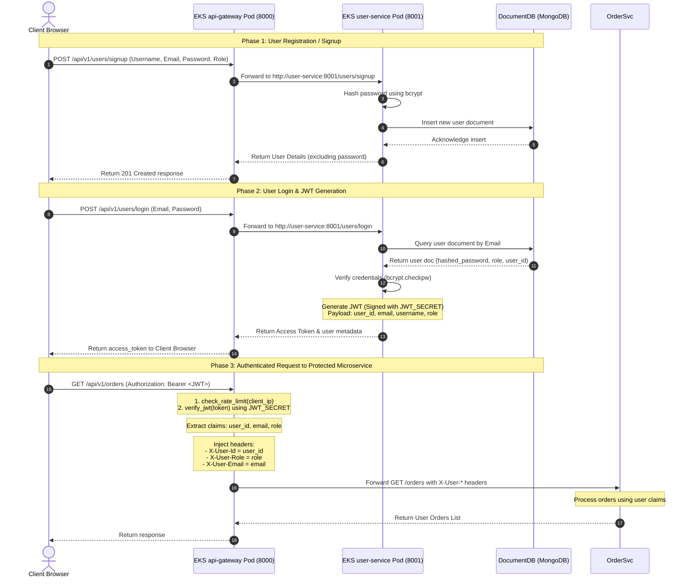

# SmartRetailX Global Commerce Platform: AWS Cloud Architecture Specification

This document provides a highly detailed, clear, and correct specification of the **SmartRetailX** production cloud architecture deployed on Amazon Web Services (AWS). It represents the exact configuration defined in the Terraform blueprints, Kubernetes manifests, and Python microservices within the workspace.

---

### 🗺️ AWS Cloud Architecture Diagram

The diagram below details the end-to-end traffic routing, network isolation, Kubernetes container pods, managed database clusters, event streaming broker, and the logging/monitoring framework across two Availability Zones (us-east-1a and us-east-1b) in a Multi-AZ topology.

```mermaid
graph TB
    %% Core Styling Definitions
    classDef client fill:#f9f9f9,stroke:#333,stroke-width:2px;
    classDef edge fill:#e1f5fe,stroke:#0288d1,stroke-width:2px,stroke-dasharray: 5 5;
    classDef vpc fill:#fff,stroke:#ff9900,stroke-width:3px;
    classDef publicSubnet fill:#fff9c4,stroke:#fbc02d,stroke-width:2px,stroke-dasharray: 5 5;
    classDef privateSubnet fill:#e8f5e9,stroke:#388e3c,stroke-width:2px,stroke-dasharray: 5 5;
    classDef eksCluster fill:#efebe9,stroke:#5d4037,stroke-width:2px;
    classDef database fill:#ede7f6,stroke:#5e35b1,stroke-width:2px;
    classDef security fill:#ffebee,stroke:#c62828,stroke-width:2px;
    classDef monitoring fill:#eceff1,stroke:#37474f,stroke-width:2px;
    classDef cicd fill:#efebe9,stroke:#ffb300,stroke-width:2px;

    %% -------------------------------------------------------------------------
    %% 1. CLIENT LAYER
    %% -------------------------------------------------------------------------
    subgraph ClientLayer ["🌐 User & Developer Client Layer"]
        User["💻 Retail Customer Browser"]
        AdminUser["💼 Store Manager / Admin Console"]
        Developer["🛠️ DevOps Developer"]
    end
    class ClientLayer client;

    %% -------------------------------------------------------------------------
    %% 2. EDGE INTERNET LAYER
    %% -------------------------------------------------------------------------
    subgraph EdgeLayer ["🛡️ Edge Routing & Security Layer"]
        Route53["🗺️ Amazon Route 53 (DNS)"]
        S3Bucket["📦 Amazon S3 Bucket (Product Public Assets)"]
    end
    class EdgeLayer edge;

    %% Client Routing
    User & AdminUser --> Route53
    Route53 --> ALB
    User & AdminUser --> S3Bucket
    
    %% -------------------------------------------------------------------------
    %% 3. VPC NETWORKING
    %% -------------------------------------------------------------------------
    subgraph VPC ["☁️ Amazon VPC (CIDR: 10.0.0.0/16) - Target Region: us-east-1"]
        IGW["🌐 Internet Gateway"]
        
        %% 3.1 PUBLIC SUBNETS (Ingress & Outbound)
        subgraph PubSubnets ["🔓 Public Subnets (Cross-AZ External Ingress)"]
            
            subgraph PubSubnetA ["Public Subnet A (10.0.1.0/24) - us-east-1a"]
                ALB["⚖️ Ingress Application Load Balancer (ALB)"]
                NAT_A["🔌 NAT Gateway A"]
            end
            class PubSubnetA publicSubnet;
            
            subgraph PubSubnetB ["Public Subnet B (10.0.2.0/24) - us-east-1b"]
                ALB_GW["⚖️ API Gateway Load Balancer (Port 8000)"]
                NAT_B["🔌 NAT Gateway B"]
            end
            class PubSubnetB publicSubnet;
            
        end
        class PubSubnets publicSubnet;
        
        %% Ingress Paths
        IGW <--> ALB & ALB_GW

        %% 3.2 PRIVATE SUBNETS (Internal Application & Data Layer)
        subgraph PrivSubnets ["🔒 Private Subnets (App & Database Layers)"]
            
            %% 3.2.1 AMAZON EKS CLUSTER
            subgraph EKS ["☸️ Amazon EKS Cluster (smartretailx-eks-prod)"]
                
                subgraph AZ_A_Pods ["EKS Nodes (us-east-1a)"]
                    frontend_pod["frontend pod (80) - Nginx React SPA"]
                    api_gw_pod["api-gateway pod (8000) - JWT Validator"]
                    user_pod["user-service pod (8001) - Credentials"]
                    product_pod["product-service pod (8002)"]
                    order_pod["order-service pod (8003)"]
                    xray_daemon_a["xray-daemon pod"]
                end
                
                subgraph AZ_B_Pods ["EKS Nodes (us-east-1b)"]
                    payment_pod["payment-service pod (8004)"]
                    inventory_pod["inventory-service pod (8005)"]
                    notif_pod["notification-service websocket pod (8006)"]
                    prom_graf_pod["Prometheus/Grafana telemetry pods"]
                    xray_daemon_b["xray-daemon pod"]
                end
                
            end
            class EKS eksCluster;

            %% Ingress connections to EKS Pods
            ALB --> |HTTP Path / Port 80| frontend_pod
            ALB --> |WS Traffic /ws Port 8006| notif_pod
            ALB_GW --> |HTTP /api/v1/* Port 8000| api_gw_pod

            %% Inter-Pod connections to DBs
            product_pod & inventory_pod & api_gw_pod --> RedisPrimary
            user_pod & product_pod & order_pod & inventory_pod --> DocDBPrimary
            payment_pod --> RDSMaster

            %% Internal Proxy Routing from Gateway Pod to microservices
            api_gw_pod --> |Proxy + User Claims Header Injection| user_pod & product_pod & order_pod & payment_pod & inventory_pod

            %% 3.2.2 POLYGLOT DATABASE LAYER
            subgraph Databases ["🗄️ Polyglot Database Cluster Layer"]
                %% Redis Cluster
                subgraph RedisCluster ["Amazon ElastiCache Redis Cluster"]
                    RedisPrimary["Redis Primary Node (AZ-B)"]
                    RedisReplica["Redis Read Replica (AZ-A)"]
                end
                class RedisCluster database;
                
                %% DocumentDB Cluster
                subgraph DocDBCluster ["Amazon DocumentDB (MongoDB-compatible)"]
                    DocDBPrimary["DocumentDB Primary Instance (AZ-A)"]
                    DocDBReplica["DocumentDB Replica Instance (AZ-B)"]
                end
                class DocDBCluster database;

                %% RDS Postgres DB
                subgraph RDSPostgres ["Amazon RDS PostgreSQL Multi-AZ"]
                    RDSMaster["RDS PostgreSQL Master (AZ-B)"]
                    RDSStandby["RDS PostgreSQL Standby (AZ-A)"]
                end
                class RDSPostgres database;
            end
            class Databases database;

            %% 3.2.3 MANAGED STREAMING FOR KAFKA (MSK)
            subgraph EventStream ["📨 Amazon MSK (Managed Streaming for Apache Kafka)"]
                MSK_Broker1["MSK Broker 1 (AZ-A)"]
                MSK_Broker2["MSK Broker 2 (AZ-B)"]
            end
            class EventStream database;

            %% Microservice Event Broker Lines
            order_pod --> |Publish: order-events| MSK_Broker1
            payment_pod --> |Publish: payment-events| MSK_Broker2
            inventory_pod --> |Publish: inventory-events| MSK_Broker2
            
            MSK_Broker1 --> |Consume: order-events| payment_pod & inventory_pod
            MSK_Broker2 --> |Consume: payment-events| inventory_pod & notif_pod

            %% 3.2.4 SERVERLESS NOTIFICATION TRIGGER
            SQS["📨 Amazon SQS Queue (notification-queue-prod)"]
            Lambda["⚡ AWS Lambda (smartretailx-notifier-prod)"]
            
            inventory_pod -.-> |Publish Alerts| SQS
            payment_pod -.-> |Publish Fraud Alerts| SQS
            SQS --> |Trigger SQS Event Source Mapping| Lambda
            Lambda --> |Send emails| SES["✉️ Amazon SES"]
            Lambda --> |Webhooks| Slack["💬 Slack Webhook Target"]
            
        end
        class PrivSubnets privateSubnet;

        %% NAT Gateways outbound Routing
        AZ_A_Pods & AZ_B_Pods --> NAT_A & NAT_B
        NAT_A & NAT_B --> IGW
        
    end
    class VPC vpc;

    %% 4. SECURITY & OBSERVABILITY LAYER
    subgraph SecurityControl ["🔑 Security & Identity Layer"]
        IAM["IAM Roles for Service Accounts (IRSA)"]
        SecretsManager["🔑 AWS Secrets Manager"]
        KMS["🔑 AWS Key Management Service (KMS)"]
    end
    class SecurityControl security;
    
    subgraph ObservabilityStack ["📊 Observability & Telemetry Layer"]
        CloudWatch["☁️ AWS CloudWatch (Logs/Alarms)"]
        XRay["🔬 AWS X-Ray Console (Distributed Tracing)"]
        GrafanaCloudWatch["📊 Grafana (Integrated CloudWatch Insights)"]
    end
    class ObservabilityStack monitoring;

    %% Infrastructure dependencies
    EKS & Databases & Lambda -.-> SecretsManager
    EKS -.-> |FluentBit stdout logs| CloudWatch
    xray_daemon_a & xray_daemon_b -.-> |Ship UDP Traces| XRay
    CloudWatch -.-> GrafanaCloudWatch

    %% 5. DEVOPS CI/CD PIPELINE
    subgraph CICDPipeline ["🛠️ Continuous Integration & Deployment Pipeline"]
        Github["GitHub Repo (Commits)"]
        GHActions["GitHub Actions CI Workflow"]
        ECR["📦 Amazon Elastic Container Registry (ECR)"]
        Terraform["🏗️ Terraform IaC Blueprints"]
    end
    class CICDPipeline cicd;

    Developer --> Github
    Github --> GHActions
    GHActions --> |Publish Images| ECR
    GHActions --> |Deploy manifests & run tf| Terraform
    ECR --> |Image Pull| EKS
    Terraform --> |Provision/Update| VPC & EKS & Databases & EventStream & Lambda
```


---rm
    ECR --> |Image Pull| EKS
    Terraform --> |Provision/Update| VPC & EKS & Databases & EventStream & Lambda
    
```

---

## 📊 VPC & Subnet Configuration Details

The AWS resources are isolated within a Virtual Private Cloud (VPC) with a classless CIDR allocation of `10.0.0.0/16`. Subnets are distributed across two Availability Zones for structural high-availability.

| Resource Type | Name / Tag | IPv4 CIDR Block | Availability Zone | Purpose / Notes |
| :--- | :--- | :--- | :--- | :--- |
| **VPC** | `smartretailx-vpc` | `10.0.0.0/16` | Multi-AZ | Main network boundary hosting all platform components. |
| **Public Subnet** | `prod-public-us-east-1a` | `10.0.1.0/24` | `us-east-1a` | Hosts **NAT Gateway A** and **Application Load Balancer (ALB)** ingress. |
| **Public Subnet** | `prod-public-us-east-1b` | `10.0.2.0/24` | `us-east-1b` | Hosts **NAT Gateway B** (if configured) for load distribution. |
| **Private Subnet** | `prod-private-us-east-1a` | `10.0.10.0/24` | `us-east-1a` | Hosts **EKS Nodes** (Zone A), **DocumentDB Primary**, **ElastiCache Read Replica**, **RDS Standby Replica**, and **MSK Broker 1**. |
| **Private Subnet** | `prod-private-us-east-1b` | `10.0.11.0/24` | `us-east-1b` | Hosts **EKS Nodes** (Zone B), **DocumentDB Replica**, **ElastiCache Primary**, **RDS Master Instance**, and **MSK Broker 2**. |

---

## 🛠️ Deep-Dive Architectural Layer Specifications

### 1. Ingress & Traffic Routing Layer
- **Amazon Route 53**: Resolves global DNS routing requests, directing user traffic to the platform's public Load Balancers.
- **Application Load Balancers (ALBs)**:
  - **Ingress ALB (HTTP port 80 & WS port 8006)**: Serves as the public entrypoint for the frontend web application and live updates. Routed via `ingress.yaml`, it maps path `/` to the EKS-hosted `frontend` pod and `/ws` to the `notification-service` websocket pod.
  - **API Gateway Load Balancer (Port 8000)**: Serves as the public load balancer for API requests, routing them to the EKS `api-gateway` pod.
- **Amazon S3 (Assets Bucket)**: Stores public assets such as product catalog images, which are fetched directly by client browsers (e.g. from `https://smartretailx-public-assets.s3.amazonaws.com/products/`).

### 2. EKS API Gateway & Internal Routing
- **EKS api-gateway Pod (Port 8000)**:
  - Serves as the central API router inside the Kubernetes cluster.
  - Intercepts requests, validates JWT access tokens cryptographically, extracts user claims, and injects identity headers (`X-User-Id`, `X-User-Role`, `X-User-Email`) before proxying them to internal microservice endpoints.
  - Applies a default client rate-limiting logic using **Amazon ElastiCache Redis**.

### 3. Elastic Container Compute Layer (Amazon EKS)
- **EKS Managed Node Groups**: Running on `t3.medium` EC2 worker nodes distributed across both Availability Zones (`us-east-1a` and `us-east-1b`).
- **Kubernetes Pods Configuration**:
  - `frontend`: Serves the React SPA static files via Nginx on Port 80.
  - `api-gateway`: Validates JWTs, injects custom claims headers, and reverse proxies requests to microservices on Port 8000.
  - `user-service`: Manages user credentials/roles (RBAC) in DocumentDB, hashes passwords via `bcrypt`, and generates signed JWT access tokens on Port 8001.
  - `product-service`: Manages catalog item searches and details on Port 8002.
  - `order-service`: Coordinates cart checkouts and publishes purchase events to Apache Kafka on Port 8003.
  - `payment-service`: Simulates card payments, records ledger records to RDS Postgres, and publishes payment completion events on Port 8004.
  - `inventory-service`: Manages product stock counts, handles Redis caching of margins, and queues low-stock notifications on Port 8005.
  - `notification-service`: Streams live WebSocket fulfillment updates to user browsers on Port 8006.
- **Two-Tier Autoscaling Loop**:
  - **Horizontal Pod Autoscalers (HPAs)** monitor average CPU load. When resource limits cross `70%`, HPAs trigger and scale microservice deployments up to 10 replicas.
  - **Kubernetes Cluster Autoscaler** monitors pending pods. If the EKS worker nodes lack the CPU capacity to host new replicas, the autoscaler triggers the AWS Auto Scaling group to provision additional EC2 instances.

### 4. Polyglot Persistence & Caching Cluster Layer
- **Amazon DocumentDB (MongoDB-compatible)**:
  - Utilized by read-heavy / document-centric services: `user-service`, `product-service`, `order-service`, and `inventory-service`.
  - Configured as a highly available cluster with an active Master instance in `us-east-1a` and a standby Replica instance in `us-east-1b` with automated failover.
- **Amazon RDS PostgreSQL (Multi-AZ)**:
  - Dedicated to the `payment-service` to guarantee strict ACID transactions for payment logs.
  - Deploys a primary writer master database instance in `us-east-1b` and a synchronous standby replica in `us-east-1a` to prevent data loss.
- **Amazon ElastiCache Redis Cluster**:
  - Used for API rate-limiting limits, product catalogue cache storage, and inventory levels tracking.
  - The cache operates in a primary-replica configuration across zones to ensure high availability.

### 5. Asynchronous Event Mesh & Notification Broker
- **Amazon MSK (Managed Streaming for Apache Kafka)**:
  - Deploys Kafka brokers into private subnets across both AZs.
  - Handles asynchronous microservice communications to support eventual consistency (Saga Pattern choreography).
  - Topic topology includes 3 partitions for `order-events` and `payment-events` to allow concurrent consumer scaling, and 1 partition for `inventory-events`.
- **Amazon SQS & Serverless Lambda**:
  - A serverless event pipeline for critical notifications.
  - The SQS queue (`notification-queue-prod`) buffers event notifications.
  - **AWS Lambda** (`smartretailx-notifier-prod`) runs inside the VPC private subnets, triggered by SQS.
  - Integrates with **Amazon SES (Simple Email Service)** to distribute low stock alerts and payment confirmations, and sends instant security alerts to **Slack/Discord webhooks** when fraud attempts are blocked.

### 6. Observability, Metrics & Telemetry Layer
- **kube-prometheus-stack (Helm)**: Runs inside the EKS `monitoring` namespace, scraping metrics from every FastAPI container `/metrics` endpoint. Operators inspect node performance and queue lag using a **Grafana Dashboard**.
- **FluentBit / AWS CloudWatch Agent**: Scrapes container logs from node disks and forwards them to **Amazon CloudWatch Logs**. Alarms trigger notification dispatches (via SNS) if failures spike.
- **AWS X-Ray Daemon**: Runs as a daemonset across EKS worker nodes, receiving application traces via UDP (port 2000) and shipping them to the **AWS X-Ray Service** for end-to-end transaction tracing.

---

## 🔑 Authentication Flow & Data Paths Detail

### 1. Split-Responsibility Authentication Architecture
Rather than employing a single consolidated authentication service, the platform splits auth duties between the **user-service pod** (credentials verification & token generation) and the **api-gateway pod** (cryptographic JWT validation & downsteam headers injection):



### 2. End-to-End Architecture Data Flow Paths

#### Path A: Loading the UI App (React SPA)
1. **Request**: The **Client Browser** navigates to `http://<alb-dns>/`.
2. **DNS Resolution**: Route 53 maps the request to the Ingress ALB DNS.
3. **Ingress Ingress ALB**: Matches path `/` and forwards the request to the private subnet IP of the EKS **frontend pod** on port 80.
4. **Nginx Delivery**: The `frontend` pod runs Nginx, which loads the prebuilt React Single Page Application (SPA) package (`dist/index.html` and assets) and sends it back to the client browser.

#### Path B: Authentication & Token Issuance (Login)
1. **Form submission**: The user enters their email and password in the React login UI.
2. **Inbound HTTP Request**: The client application issues a POST request to the API Gateway Load Balancer endpoint: `http://<gateway-alb-dns>:8000/api/v1/users/login`.
3. **Routing to api-gateway**: The Load Balancer forwards the traffic to the EKS **api-gateway pod** (port 8000).
4. **Proxy to user-service**: The `api-gateway` proxies the request via internal Kubernetes DNS to `http://user-service:8001/users/login`.
5. **Validation & JWT Generation**:
   - The **user-service pod** queries **Amazon DocumentDB** to retrieve the user's data.
   - It validates the credentials by running `bcrypt.checkpw(plain_password, hashed_password)`.
   - It compiles the token payload (`user_id`, `role`, `email`, `username`) and encodes it as a JWT signed with `JWT_SECRET`.
6. **Response**: The user service returns the token, which is returned by the API Gateway to the browser to be stored in local storage (`sr_token`).

#### Path C: Authenticated Request to a Protected Endpoint (e.g., Fetching Orders)
1. **Request with Authorization**: The client React app makes a call to `GET /api/v1/orders` using the token: `Authorization: Bearer <JWT>`.
2. **Ingress to Gateway**: The request hits the API Gateway Load Balancer and is routed to the **api-gateway pod** on port 8000.
3. **JWT Extraction & Validation**:
   - The `api-gateway` intercepts the request.
   - It decodes the JWT using the shared `JWT_SECRET` and checks for signature integrity and expiration.
   - If invalid, the gateway returns a `401 Unauthorized` directly to the client.
4. **Header Injection**: If the token is valid, the gateway extracts the payload claims and injects them as new downstream headers: `X-User-Id`, `X-User-Role`, and `X-User-Email`.
5. **Downstream Routing**: The gateway forwards the request to the internal Kubernetes service URL `http://order-service:8003/orders` containing the injected headers.
6. **Processing & Event Publishing**:
   - The **order-service pod** receives the request and trusts the injected headers for business operations.
   - It reads the database from **Amazon DocumentDB** using the `X-User-Id` filter.
   - If the operation changes states (e.g., placing a new order), it publishes events onto the Kafka topic `order-events` on **Amazon MSK**.
7. **Response**: The order service returns the payload, which goes back through the API gateway to the client browser.

---

## 🔄 Previous vs. Current Architectural Comparison

The current production system has been modernised significantly compared to the legacy outline provided in the previous architecture. The major updates include:

| Architectural Component | Legacy Architecture (Previous) | Modernized Production Architecture (Current) | Rationale & Improvements |
| :--- | :--- | :--- | :--- |
| **Compute Orchestration** | ECS Tasks with Auto-Scaling | **Amazon EKS (Kubernetes)** | Standardizes container deployment, allows fine-grained Horizontal Pod Autoscaling (HPA), and simplifies integration with Kubernetes-native tools like Prometheus. |
| **Core API Gateway** | Custom code / ALB routing | **AWS API Gateway v2 (HTTP API) + VPC Link** | Replaces custom proxying with a fully managed AWS service, offering native routing, stage versioning, CloudWatch logs integration, and native traffic throttling. |
| **Database Model** | Dual Aurora PostgreSQL instances | **Polyglot Cluster: Amazon DocumentDB (MongoDB) + RDS PostgreSQL** | Isolates document-centric microservices in DocumentDB for schema flexibility while keeping financial payment transactions in relational PostgreSQL (ACID compliant). |
| **Event Broker Stream** | Kinesis / AWS Lambda integration | **Amazon MSK (Managed Apache Kafka)** | Transitioned to a standard Kafka event stream for low-latency asynchronous publish-subscribe processing across backend services. |
| **Notification Engine** | Pure Serverless WebSockets | **Dual-Path: In-cluster WebSockets + VPC Lambda & SQS** | In-cluster FastAPI pods manage persistent browser WebSocket lines (`/ws`), while serverless SQS + VPC Lambda handles asynchronous email/Slack deliveries. |
| **Security & Identity** | Amazon Cognito + User Groups | **Custom API Gateway PyJWT Validation + RBAC** | Custom API Gateway pod performs fast cryptographic validation of signed JWT tokens, passing verified roles (`Customer`, `Manager`, `Admin`) to downstream services. |
| **Monitoring & Telemetry** | CloudWatch & OpenSearch Stack | **kube-prometheus-stack + AWS X-Ray Distributed Tracing** | Integrates Prometheus/Grafana dashboards for real-time application metrics, combined with X-Ray daemonsets to trace requests across microservices. |
| **CI / CD Pipeline** | CodePipeline / AWS CodeCommit | **GitHub Actions + Amazon ECR + Terraform Blueprints** | Modernizes the deployment lifecycle by running automated tests in GitHub, compiling images to ECR, and syncing AWS infrastructure using Terraform IaC. |
